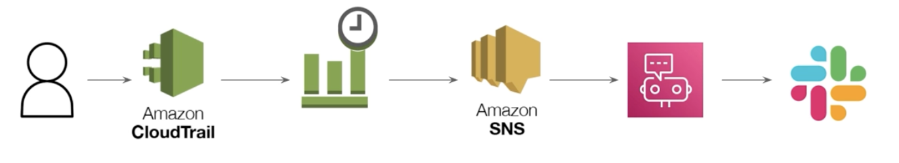

# DevSeOps Best Practice Architecture


## Todo

- [x] AWS VPC Endpoint
- [ ] CloudTrail Pipeline
- [ ] Automatino AccessKey, SecretKey

## VPC

## Cloud-Trail-Pipelin (계정 감사용)

```
    cd infra/cloudtrail-pipeline
```

- [x] S3
- [x] Cloud-Trail
- [x] Event Bridge (Rule)
- [x] SNS
- [x] AWS Chatbot to Slack




## Reference

- terraforming 설치 (only AWS)

```sh
    ## Install Terraforming
    gem install terraforming

    ## If Error )
    ## ERROR:  While executing gem ... (Gem::FilePermissionError)
    ## You don't have write permissions for the /Library/Ruby/Gems/2.6.0 directory.
    sudo gem install terraforming
```

- Terraform provider 운영

```sh
    ## provider.tf 는 심볼릭링크로 운용합니다.
    ln -s ../provider.tf provider.tf
```
