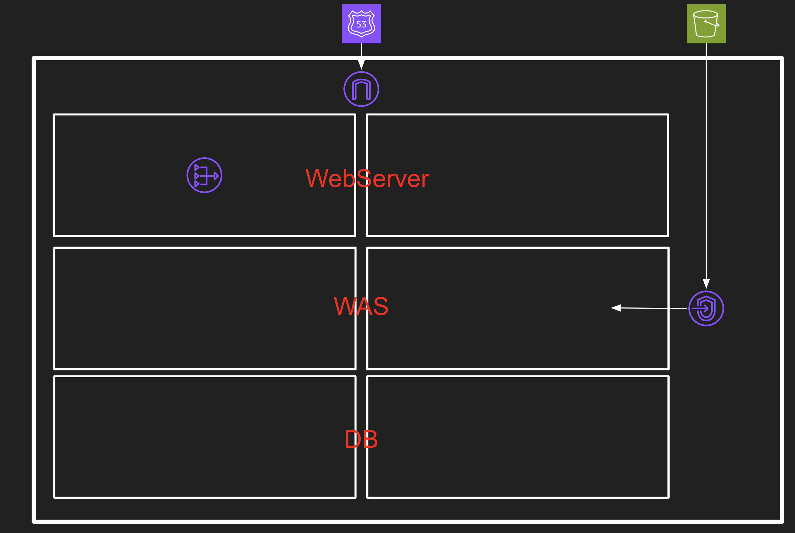
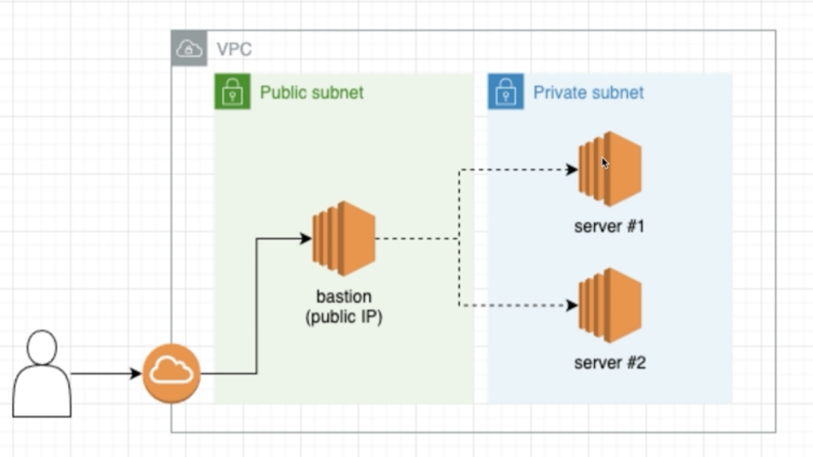
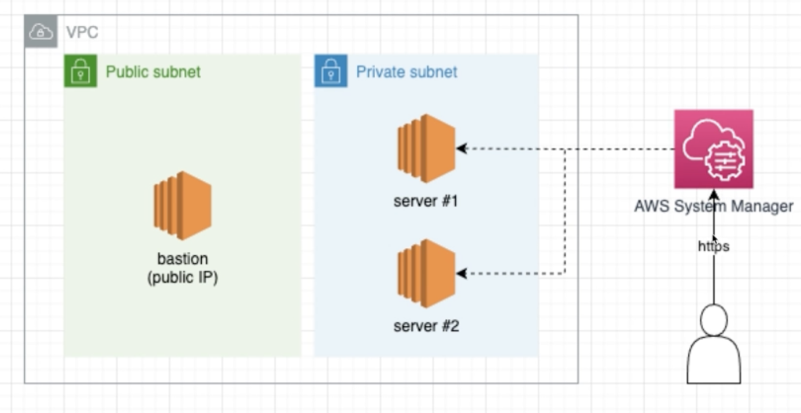

# DevSeOps Best Practice Architecture

## 1. VPC

```
    cd infra/networks
```

- [x] vpc
- [x] vpc-endpoint



- 기본적인 3-tier architecture 입니다.
- S3, DynamoDB 같은 경우 Private Subnet 에서의 통신은 VPC-Endpoint (Gateway, Interface) 를 사용하여 통신합니다.

## 2. Cloud-Trail-Pipelin (계정 감사용)

```
    cd infra/cloudtrail-pipeline
```

- [x] S3
- [x] Cloud-Trail
- [x] Event Bridge (Rule)
- [x] SNS
- [x] AWS Chatbot to Slack


## 3. EC2 접근방법

- 1. Teleport를 사용한 EC2 접근
    - <a href="https://github.com/zkfmapf123/DevSecOps-Teleport"> Teleport </a>
    

- 2. Session Manager + GoSSM 을 사용한 EC2 접근 **
    - <a href="https://github.com/aws-donggyus-lab/aws_vpc_pack/tree/master/session-manager"> SSM Manager </a>
    


## Reference

- terraforming 설치 (only AWS)

```sh
    ## Install Terraforming
    gem install terraforming

    ## If Error )
    ## ERROR:  While executing gem ... (Gem::FilePermissionError)
    ## You don't have write permissions for the /Library/Ruby/Gems/2.6.0 directory.
    sudo gem install terraforming
```

- Terraform provider 운영

```sh
    ## provider.tf 는 심볼릭링크로 운용합니다.
    ln -s ../provider.tf provider.tf
```
